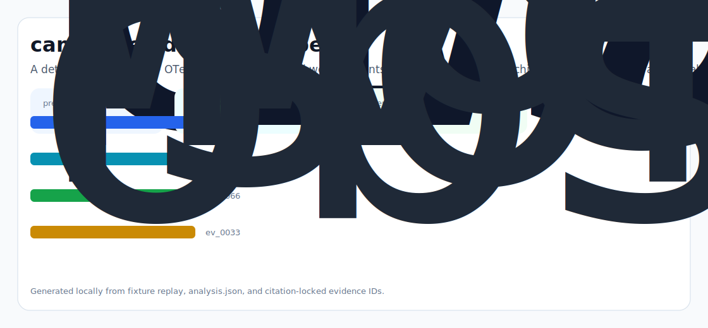
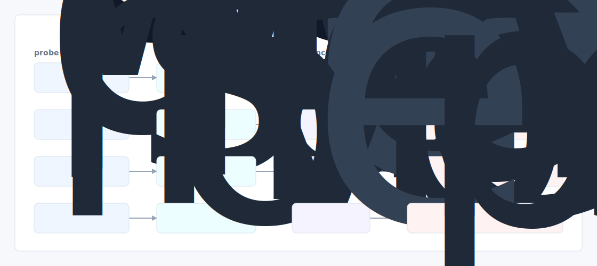

# Pi Replay

A deterministic replay + OTel tracing harness for pi worker agents - record every tool call, child Worker invocation, and Durable Object state diff; replay any session bit for bit; enforce per session budgets in the Worker runtime.



## Why it exists

pi worker lives or dies on isolation, observability, and the execute tool's reliability - but the README explicitly says the repo is "actively experimental" and only the terminal agent example is production ready.

Most internal demos stop at a pretty chart. This repository is built around the harder part: a repeatable path from fixture, to failure, to evidence, to the operator action a serious team would actually trust.

## What is inside

- A deterministic replay harness tuned around worker, lives, and isolation.
- Company-specific strategy code in `src/pi_replay/strategy.py`, not just README-level customization.
- Citation-locked reports where every decision claim has to point back to a generated evidence ID.
- Two visual artifacts generated from the latest run: `outputs/project_working.svg` and `outputs/evidence_map.svg`.
- A portable demo pack with JSON, CSV, Markdown, HTML, SVG, and benchmark artifacts.



## Signals it measures

- `worker coverage`
- `lives risk`
- `isolation precision`
- `observability latency`

## Failure modes it plants

- worker drift
- lives gap
- isolation misroute
- observability blindspot

## Run it locally

```bash
uv sync
uv run pi-replay all
uv run pytest -q
uv run ruff check .
```

## Outputs worth opening

- `outputs/dashboard.html`
- `outputs/project_working.svg`
- `outputs/evidence_map.svg`
- `outputs/operator_brief.md`
- `outputs/decision_report.md`
- `outputs/strategy_model.json`
- `outputs/demo_pack.zip`

## Sources

- https://github.com/qaml-ai
- https://github.com/qaml-ai/pi-worker
- https://github.com/qaml-ai/camelAI-docker-compose
- https://www.ycombinator.com/companies/camelai
- https://blog.cloudflare.com/durable-object-facets-dynamic-workers/
- https://linkedin.com/in/illiana-reed

## Boundary

Everything runs locally against synthetic fixtures. There are no credentials, no customer records, no outreach files, and no hosted API dependency.
